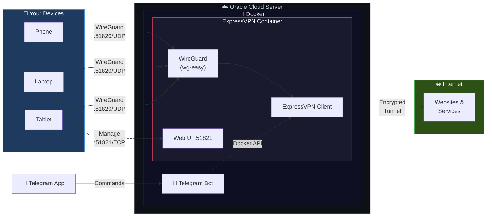

# 🛡️ ExpressVPN Gateway

**Self-hosted VPN gateway with WireGuard, controlled via Telegram**

Route all your devices through ExpressVPN using a single subscription. Connect unlimited devices via WireGuard, manage everything through a slick Web UI or Telegram bot — all running in Docker on your Oracle Cloud ARM64 server.

---

## 🏗️ Architecture



**Traffic Flow:** Device → WireGuard Tunnel → ExpressVPN Encrypted Tunnel → Internet

> Your ISP and Oracle only see encrypted tunnel traffic. Websites see the ExpressVPN exit IP.

---

## ✨ Features

| Feature | Description |
|---------|-------------|
| 🔐 **Full Encryption** | All traffic encrypted through ExpressVPN's Lightway protocol |
| 📱 **Unlimited Devices** | Connect as many devices as you want via WireGuard |
| 🤖 **Telegram Control** | Manage VPN status, switch servers, check IP — all from Telegram |
| 🌐 **Web UI** | Beautiful wg-easy dashboard for device management & traffic stats |
| 🐳 **Fully Dockerized** | One command to deploy, easy to update and maintain |
| 🔄 **Auto-Reconnect** | Automatic reconnection on VPN drops with health checks |
| 🛡️ **Privacy First** | Oracle/ISP sees only encrypted tunnel traffic |
| 📊 **Traffic Stats** | Real-time bandwidth monitoring per client |

---

## 📋 Prerequisites

- **Server**: Oracle Cloud ARM64 Ubuntu instance (free tier works!)
- **Docker**: Docker Engine & Docker Compose v2 installed
- **ExpressVPN**: Active subscription with activation code
- **Telegram**: Bot token from [@BotFather](https://t.me/BotFather)

---

## 🚀 Quick Start

### Step 1: Get Your Credentials

| Credential | Where to Get It |
|-----------|----------------|
| ExpressVPN Activation Code | [expressvpn.com/setup](https://www.expressvpn.com/setup) → Sign in → Manual config |
| Telegram Bot Token | Message [@BotFather](https://t.me/BotFather) → `/newbot` → Follow prompts |
| Your Telegram User ID | Message [@userinfobot](https://t.me/userinfobot) → It replies with your ID |
| Server Public IP | OCI Console → Compute → Instance details, or `curl -4 ifconfig.me` |

### Step 2: Upload Files to Server

```bash
# Clone or copy the project files to your server
scp -r ./ExpressSetup ubuntu@YOUR_SERVER_IP:~/ExpressSetup
cd ~/ExpressSetup
```

### Step 3: Configure Environment

```bash
# Copy example config
cp .env.example .env

# Edit with your values
nano .env
```

Fill in these required values:
- `ACTIVATION_CODE` — your ExpressVPN activation code
- `SERVER_PUBLIC_IP` — your Oracle server's public IP

### Step 4: Generate WireGuard Password Hash

```bash
# Generate a bcrypt hash for the wg-easy Web UI password
docker run -it ghcr.io/wg-easy/wg-easy wgpw 'YOUR_SECURE_PASSWORD'

# Copy the output and paste it as WG_PASSWORD_HASH in .env
# NOTE: If the hash contains $, escape each one as $$ in the .env file
```

### Step 5: Open Firewall Ports

#### Oracle Cloud Security List

1. Go to **OCI Console** → **Networking** → **Virtual Cloud Networks**
2. Click your VCN → **Security Lists** → **Default Security List**
3. Add **Ingress Rules**:

| Stateless | Source | Protocol | Dest Port | Description |
|-----------|--------|----------|-----------|-------------|
| No | 0.0.0.0/0 | UDP | 51820 | WireGuard tunnel |
| No | 0.0.0.0/0 | TCP | 51821 | wg-easy Web UI |

#### Ubuntu iptables

```bash
sudo iptables -I INPUT -p udp --dport 51820 -j ACCEPT
sudo iptables -I INPUT -p tcp --dport 51821 -j ACCEPT
sudo netfilter-persistent save
```

### Step 6: Build & Launch

```bash
# Build images and start all services
docker compose up -d --build

# Watch the logs (wait for ExpressVPN to connect)
docker compose logs -f

# Check all containers are running
docker compose ps
```

> ⏳ **First launch** takes ~2 minutes. ExpressVPN needs to activate and connect before WireGuard starts (health check dependency).

---

## 📱 Adding Devices

1. Open the **wg-easy Web UI** at `http://YOUR_SERVER_IP:51821`
2. Log in with the password you set
3. Click **"+ New"** to create a client
4. Name your device (e.g., "iPhone", "MacBook")
5. **Download** the `.conf` file or **scan the QR code**
6. Install the **WireGuard app** on your device:
   - [iOS](https://apps.apple.com/app/wireguard/id1441195209)
   - [Android](https://play.google.com/store/apps/details?id=com.wireguard.android)
   - [Windows](https://www.wireguard.com/install/)
   - [macOS](https://apps.apple.com/app/wireguard/id1451685025)
7. Import the config and **activate** the tunnel

---

## 🤖 Telegram Bot Commands

| Command | Description |
|---------|-------------|
| `/start` | Welcome message & command list |
| `/status` | Show VPN connection status & current server |
| `/connect` | Connect to ExpressVPN |
| `/disconnect` | Disconnect from ExpressVPN |
| `/server <location>` | Switch to a specific server (e.g., `/server us-new-york`) |
| `/servers` | List popular server locations |
| `/ip` | Show current public IP (verify VPN is working) |
| `/speedtest` | Run a speed test through the VPN tunnel |
| `/restart` | Restart the ExpressVPN container |
| `/help` | Show all available commands |

---

## 🔧 Management

### Useful Commands

```bash
# View all container statuses
docker compose ps

# View real-time logs
docker compose logs -f

# View logs for specific service
docker compose logs -f expressvpn

# Restart everything
docker compose restart

# Restart only ExpressVPN
docker compose restart expressvpn

# Stop everything
docker compose down

# Rebuild after changes
docker compose up -d --build

# Check ExpressVPN status inside container
docker exec expressvpn expressvpn status

# Check current public IP through VPN
docker exec expressvpn curl -s ifconfig.me
```

### Switching VPN Servers

```bash
# Via Telegram bot (easiest)
# Send: /server us-new-york

# Via command line
docker exec expressvpn expressvpn disconnect
docker exec expressvpn expressvpn connect us-new-york
```

---

## 🐛 Troubleshooting

### ExpressVPN Won't Connect

```bash
# Check logs for activation issues
docker compose logs expressvpn

# Verify activation code is correct in .env
grep ACTIVATION_CODE .env

# Try manual activation inside container
docker exec -it expressvpn expressvpn activate
```

### WireGuard Container Not Starting

The WireGuard container waits for ExpressVPN to be healthy (connected). Check:

```bash
# Is ExpressVPN healthy?
docker inspect expressvpn --format='{{.State.Health.Status}}'

# If stuck as "starting", check ExpressVPN logs
docker compose logs expressvpn
```

### Can't Access Web UI

1. **Check Oracle Cloud Security List** — port 51821 TCP must be open
2. **Check iptables** — `sudo iptables -L -n | grep 51821`
3. **Check container is running** — `docker compose ps`
4. Try accessing via: `http://YOUR_SERVER_IP:51821`

### Devices Connect but No Internet

```bash
# Check IP forwarding is enabled
docker exec expressvpn sysctl net.ipv4.ip_forward

# Check ExpressVPN is connected
docker exec expressvpn expressvpn status

# Check DNS resolution
docker exec expressvpn nslookup google.com
```

### Bot Not Responding

```bash
# Check bot logs
docker compose logs telegram-bot

# Verify token is correct
grep TELEGRAM_BOT_TOKEN .env

# Verify your user ID is in the allowed list
grep ALLOWED_USER_IDS .env
```

---

## 🔒 Security Notes

> [!IMPORTANT]
> Follow these security practices to keep your setup safe.

- **`.env` file** contains secrets — it's in `.gitignore` and must **never** be committed
- **Telegram bot** is restricted to your user ID only — unauthorized users are ignored
- **All traffic** is double-encrypted: WireGuard tunnel → ExpressVPN tunnel
- **ExpressVPN's no-logs policy** covers all traffic routed through their servers
- **Docker socket** is mounted read-only equivalent — the bot only needs it for `docker exec`

> [!TIP]
> For maximum security, access the wg-easy Web UI **only through the WireGuard tunnel itself** (connect a device first via QR/config, then access the UI through the tunnel). This way the Web UI port doesn't need to be publicly exposed long-term.

---

## 📁 Project Structure

```
ExpressSetup/
├── docker-compose.yml      # Service orchestration
├── .env                    # Your configuration (secrets - not in git)
├── .env.example            # Configuration template
├── .gitignore              # Git ignore rules
├── README.md               # This file
├── expressvpn/             # ExpressVPN container build context
│   ├── Dockerfile          # ARM64 ExpressVPN image
│   └── entrypoint.sh       # Startup & activation script
└── telegram-bot/           # Telegram bot build context
    ├── Dockerfile          # Bot image
    ├── bot.py              # Bot logic & commands
    └── requirements.txt    # Python dependencies
```

---

## 📄 License

This project is for personal use. ExpressVPN is a registered trademark of ExpressVPN. WireGuard is a registered trademark of Jason A. Donenfeld.
